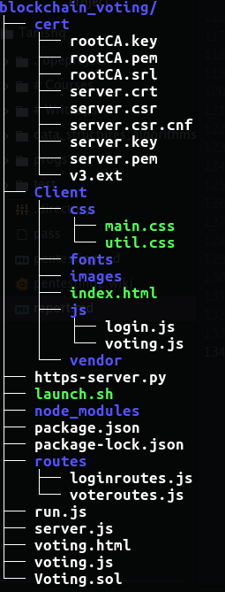
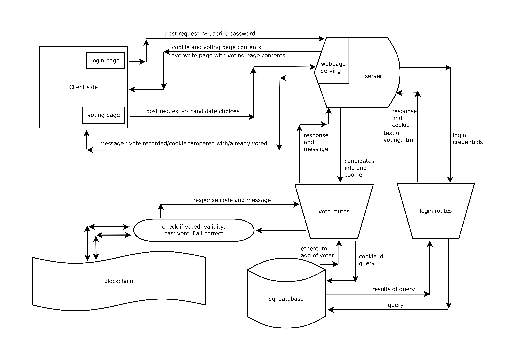
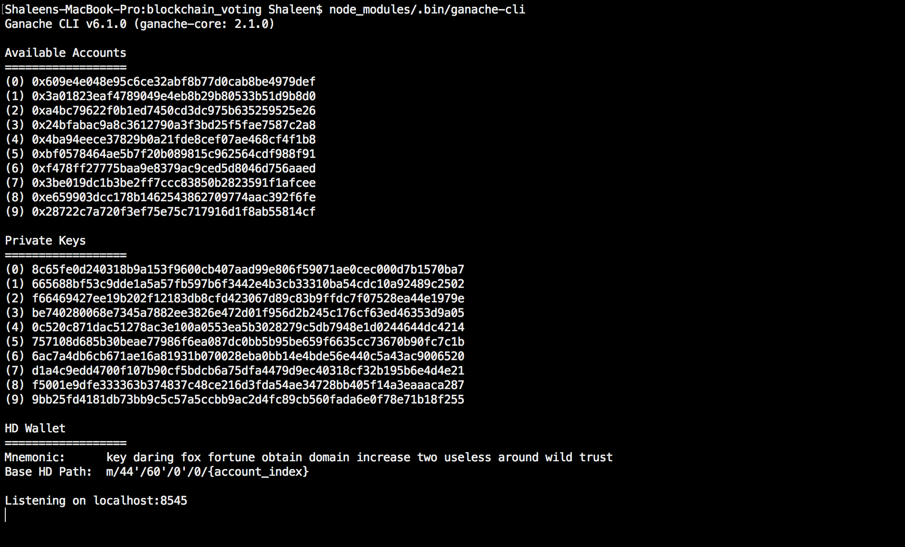
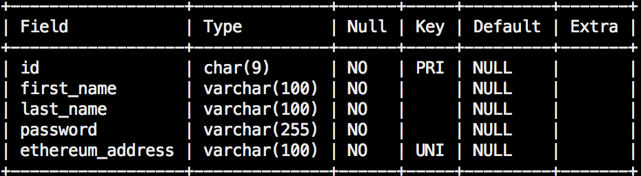
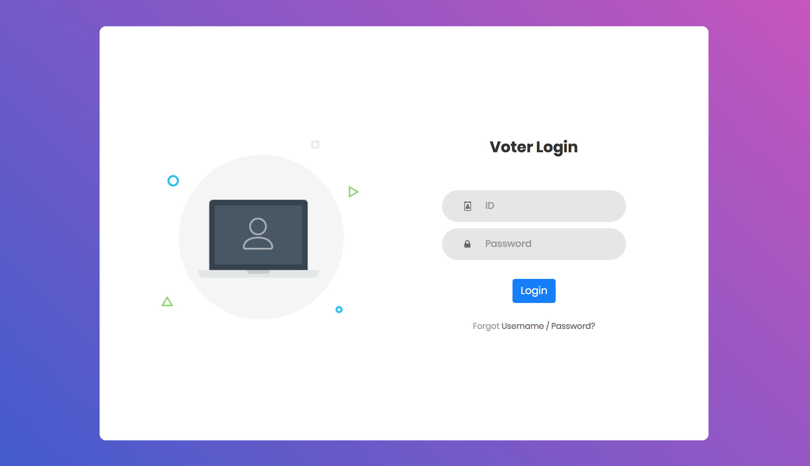
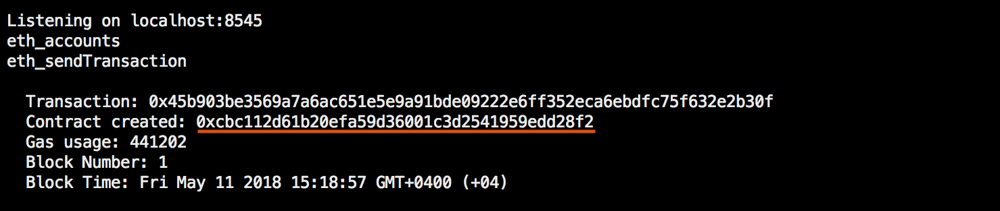

# Ethereum-based Voting App

There are a lots of problems with modern day election systems. Many people do not go to vote because they would have to wait in long queues at the polling booth. There are also cases of vote manipulation. For example, electronic voting machines can be hacked. In places where ballot boxes are used, although unlikely, counting mistakes can happen.
In our college, elections are conducted on a web portal. The portal is accessible only using the computers of the Engineering Graphics Lab. For the duration of the election, network connections in all other parts of the college are disabled so that no one can hack into the portal and manipulate votes. This might be a necessary measure but it forces everyone to survive without internet for 4-5 hours. Moreover, everyone has to wait for 10-15 minutes outside the EG Lab before they can go inside and vote.
A blockchain based solution can solve all these problems. Content once written on to a blockchain cannot be tampered in any way.  Also, all users of a blockchain can access it contents. This means that a voter can know for sure that he has voted for the intended candidate. Given these two features, we can now have a voting application on the internet without worrying about any attacks. This will allow people to vote from anywhere in the world and will significantly increase voter turnout.

---

## Set up the development environment
To setup the complete web app following steps are used -
1. Download and install [nodejs](https://nodejs.org/en/download/).
2. Download the entire project directory to your computer.
3. Navigate to the project directory. e.g. `$ cd blockchain_voting`
4. Install all nodejs dependencies by running the command `npm install`.
5. Download and install MySQL server. (Check install notes)

---

## Overview
The web application is structured in a way such that once all serving components are enabled in the back end, the client is served a login page which accepts a userID and a password, given to the client prior to the voting process.
The client side credentials are then sent to the server side as a post request over SSL. The backend then sends an acknowledgement of a successful login attempt and grants a cookie for each login. Already existing cookies are cleared before the login process proceeds as a security mechanism.
After a successful login a different html page is overwritten on the existing page. This page has selection of the candidates that need to be voted. The results of the voted candidates are again posted over SSL and the backend processes the votes by interacting with the blockchain instance running on the server.

File Structure:



Block Diagram:



---

## Ethereum Test Network
We will be using the ganache command line interface to create our blockchain for development. By default, Ganache creates 10 accounts, which will be enough for our purpose.
```
$ node_modules/.bin/ganache-cli -m "sorry tragic airport arrive tortoise notice toast mad error aware bleak chronic"
```
Run the above line from the terminal to start the blockchain. The string after -m acts like a seed for ganache to select 10 random account addresses. While, you can replace this with any other string, you might want to always use the same string so that the same accounts are generated every time. For more details about ganache-cli, visit https://github.com/trufflesuite/ganache-cli.



***

## Voting Contract

We will use the Solidity programming language to create our voting contract. A contract is a lot like a class in any object oriented programming language. The contract has a constructor which will be called when the contract is deployed to the blockchain. It also has two variables in the form of `mapping`s – totalVotesFor stores the total vote count for each candidate while hasVoted keeps track of whether a person has already voted or not.

The contract has been explained in great detail within the source code.

NOTE: Since a blockchain is immutable, if you update your contract and deploy it again, it will not replace the old contract or any of its data. The new deployment will instead create a new instance of the contract.

***

## MySQL Database
We will be storing the login details and Ethereum addresses of all eligible voters in a MySQL Database. Please check the install notes for steps to install and start the MySQL server.

Access the server by running `mysql -u root -p` from the command line and then entering the password for the Db.

Next, run the following commands to create a database and to make it active.

```SQL
CREATE DATABASE Votechain;
USE Votechain;
```

The users table will have the following schema.



Now, we'll create the table.

```SQL
CREATE TABLE users (
	id char(9) PRIMARY KEY,
	first_name varchar(100) COLLATE utf8_unicode_ci NOT NULL,
	last_name varchar(100) COLLATE utf8_unicode_ci NOT NULL,
	password varchar(255) COLLATE utf8_unicode_ci NOT NULL,
  ethereum_address varchar(100) UNIQUE NOT NULL
) ENGINE=InnoDB DEFAULT CHARSET=utf8mb4 COLLATE=utf8mb4_unicode_ci;
```

To populate the table, you can run multiple commands of the following format.

```SQL
INSERT into users values('id', 'first_name', 'last_name', 'password', 'ethereum_address');
```

The database is ready. We can now create the login page for the application.

***

## Login
We will first create a login page in order to authenticate users before they are allowed to cast their vote.

### Front End
The login page looks like this:


The input fields have constraints specified in the form of regular expressions. The ID needs to be of the form f201XXXXX. Similarly, the password needs to be a non-empty string with no whitespace characters.
The pattern attributes in the following lines perform the required checks.
```HTML
<input class="input100" type="text" name="id" placeholder="ID" required pattern="f201\d{5}">
<input class="input100" type="password" name="password" placeholder="Password" required pattern="\S+">
```
For added measure, input validation has been added to the linked javascript file, too.
```javascript
// Helper to check if input is valid
function validate (input) {
  if($(input).attr('type') == 'id' || $(input).attr('name') == 'id') {
    // Username should be like f20150999
    if($(input).val().trim().match(/^(f201[0-9]{5})$/) == null) {
      return false;
    }
  }
  else {
    // Password field should not be blank
    if($(input).val().trim() == ''){
      return false;
    }
  }
};
```

If the input fields are valid, a POST request with the ID and password is sent to the login server.

For more details, read the comments in the source code.


### Back End
Upon receiving the login POST request, the server routes the request to the login API (loginroutes.js). It checks for a matching ID and password entry in the previously created MySQL database. If found, it redirects the user to the voting page and sets a cookie named UserID with the user's ID. Otherwise, it displays an error message.

***

## Voting

### Front End
The client side of the voting page is very simple. The voter selects the candidates he wishes to vote for using the radio buttons and then presses the Vote button. The voter is then asked to confirm his selection. Upon confirmation, a POST request with the names of the selected candidates is sent to the server. Again, the body of the request is a url encoded form.

## Back End
The server routes the request to the voting API (voteroutes.js). It checks for and verifies the signed UserID cookie. If OK, it fetches the Ethereum address of the voter and calls the voteForCandidates function present in the server side voting.js. This function has been put in a separate file to keep voteroutes.js abstract. Voting.js is the script that communicates with the blockchain. It first checks if the voter has already voted. If not, it calls the voteForCandidates method in the contract.

**IMPORTANT NOTE:** Make sure you change the password field in loginroutes.js and voteroutes.js to that of your MySQL server.

```javascript
// Create connection to MySQL database with given details
var connection   = mysql.createConnection({
  host     : 'localhost',
  user     : 'root',
  password : 'PLEASE CHANGE THIS',
  database : 'Votechain'
});
```

***

## Security
From the security point of view, three mechanisms are considered. They are - helmet, cookies and SSL.
SSL is added to make the channel of communication encrypted such that all data is transferred over https.
Self signed certificates are used which are present in the `cert/` folder. The procedure of creating a self signed certificate is described in the install notes.
The web page is served from an https server implemented as a module in python. The code used for this is -
```python
import http.server, ssl
server_address = ('', 8000)
httpd = http.server.HTTPServer(server_address, http.server.SimpleHTTPRequestHandler)
httpd.socket = ssl.wrap_socket(httpd.socket,
                               server_side=True,
                               certfile='../cert/server.pem',
                               ssl_version=ssl.PROTOCOL_TLSv1)
httpd.serve_forever()
```
The certificate file is given as an argument to the httpd object. This script is executed from inside the `Client/` folder so that the html file in that folder is used to serve the client.
The server file also has the certificate options to exchange data only over SSL on port 5000.
```js
var certOptions = {
  key: fs.readFileSync('cert/server.key'),
  cert: fs.readFileSync('cert/server.crt')
};
var server = https.createServer(certOptions, app).listen(5000);
```

Cookies play a very important role in the application. They help authenticate the user as well as make sure a session is not hijacked. The cookies have several parameters out of which the `secure` parameter is set to true to enable the functioning of the cookies over SSL, the `httpOnly` parameter is set to true so that no client side javascript code can modify the cookie or read it using `document.read()`. The cookie is also signed using a secret key such that any adversary is unable to generate a valid cookie, signature pair; thus the `signed` parameter is also set to true.
The cookie is also cleared at the time of login before any authentication procedure processing to ensure no predefined cookie by the same name exists. This also rules out the possibility of an attacker copying a cookie and trying logging in again. If the credentials are valid and authentication procedure passes, then a new cookie is generated from the server side and is sent back to the client along with the text of the voting page which is then rendered on the client side. This is performed by the following snippet.
```js
// ........................
if(results.length > 0) {
  if(results[0].password == password) {
    res.status = 200;
    res.cookie('UserID', id, { maxAge: 120000, httpOnly: true, signed: true, secure: true});
    console.log('cookie created successfully');
    res.setHeader('Content-type', 'text/html');
    voting = fs.readFileSync('/Users/Shaleen/blockchain_voting/voting.html');
    res.write(voting);
    res.end();
  }
  // .......................
}
// ........................
```
The cookie also has a max lifetime to emulate proper flow of voting channels. Once this time period is over, the cookie becomes invalid and thus cannot be used for authentication. This is set using the maxAge paramete as shown in the above snippet.

The cookie is preserved on the voting page when it is overwritten on the existing page and is used for further authentication before casting a vote. When the `vote` api receives the post request of the chosen candidates, the cookie is also sent along in the XMLHttpRequest. The api then reads the cookie using the same secret that was used to sign it. The data that is signed is the id of the vote caster. The id is then retrieved after verifying the signature and is used to query the database to retrieve the ethereum address, which in turn is used to record the casted vote. After the vote casting procedure is complete, the cookie is then cleared from the client side and the page reloads giving the login page again. The cookie check and the clearing takes place in the following snippet -
```js
// .......................
var id = req.signedCookies.UserID;
// .......................
// .......................
if(results.length > 0) {
  console.log(id);
  addr = results[0].ethereum_address;
  var code = voting.voteForCandidates(addr, presidentName, vicePresidentName);
  res.clearCookie("UserID");
  res.sendStatus(code);
}
// .......................
```

Helmet is also used in the application to add security related headers to all network activity. Helmet is actually just a collection of nine smaller middleware functions that set security-related HTTP headers:
1. `csp` sets the Content-Security-Policy header to help prevent cross-site scripting attacks and other cross-site injections.
2. `hidePoweredBy` removes the X-Powered-By header.
3. `hpkp` Adds Public Key Pinning headers to prevent man-in-the-middle attacks with forged certificates.
4. `hsts` sets Strict-Transport-Security header that enforces secure (HTTP over SSL/TLS) connections to the server.
5. `ieNoOpen` sets X-Download-Options for IE8+.
6. `noCache` sets Cache-Control and Pragma headers to disable client-side caching.
7. `noSniff` sets X-Content-Type-Options to prevent browsers from MIME-sniffing a response away from the declared content-type.
8. `frameguard` sets the X-Frame-Options header to provide clickjacking protection.
9. `xssFilter` sets X-XSS-Protection to enable the Cross-site scripting (XSS) filter in most recent web browsers.

Helmet can be used by following code -
```js
var helmet = require('helmet');
app.use(helmet());
```

SQL injection is also prevented for any interactions with the sql database. This is done by parameterized sql query -

```js
connection.query('SELECT * FROM users WHERE id = ?',[id], function (error, results, fields) {});
```
The `?` is replaced by the exact string that is entered by the user, therefore no special character interpretation works, instead the exact input is used as it is for the query. This prevents SQL injection attacks.

***

## Deploy the Application

* Replace P1, VP1, etc. in line 11 of `run.js` with the names of the candidates. Also make these changes in `voting.html`.
* Replace 10.30.26.212 in all files with the IP address of the serving machine.
* To start all the processes required to deploy the application, simply run `./launch.sh` from the parent directory, i.e, `blockchain_voting/`.
* Once the services are running, ganache-cli will display a transaction with a field `Contract created`. Copy the value of this field and paste it in line 12 of `./voting.js` in place of the existing address.



***

## Install notes

### MySQL Server
#### Install Homebrew
* Installing Homebrew is effortless, open Terminal and enter :  
 `$  /usr/bin/ruby -e "$(curl -fsSL https://raw.githubusercontent.com/Homebrew/install/master/install)"`
* **Note:** Homebrew will download and install Command Line Tools for Xcode as part of the installation process.
* Install **brew services**: `$ brew tap homebrew/services`

#### Install and set up MySQL
* To install MySQL enter : `$ brew install mysql`
* Load and start the MySQL service : `$ brew services start mysql`.   

* Open Terminal and execute the following command to set the root password:  
`mysqladmin -u root password 'yourpassword'`

* **Note**: To stop the mysql service, run `$ launchctl unload ~/Library/LaunchAgents/homebrew.mxcl.mysql.plist`

***

### Digital Certificates
You will have to create your own SSL certificate so that it works with your IP address. Clear the contents of the `cert/` folder and then follow [this article](https://medium.freecodecamp.org/how-to-get-https-working-on-your-local-development-environment-in-5-minutes-7af615770eec) upto ***Use your new SSL certificate*** while you are inside the `cert/` folder to create your certificate.
**IMPORTANT**: Add a field IP.1 = 'your IP address' to v3.ext before generating the certificate.

***
